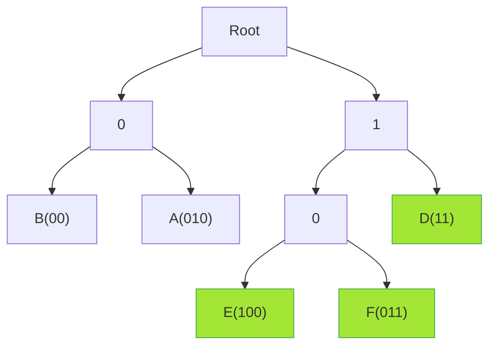
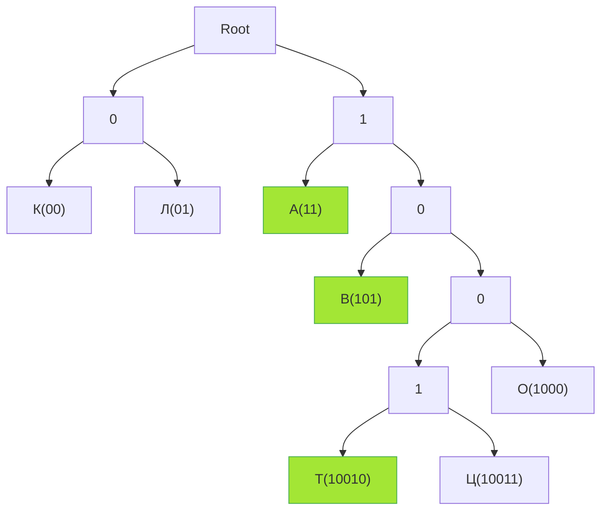
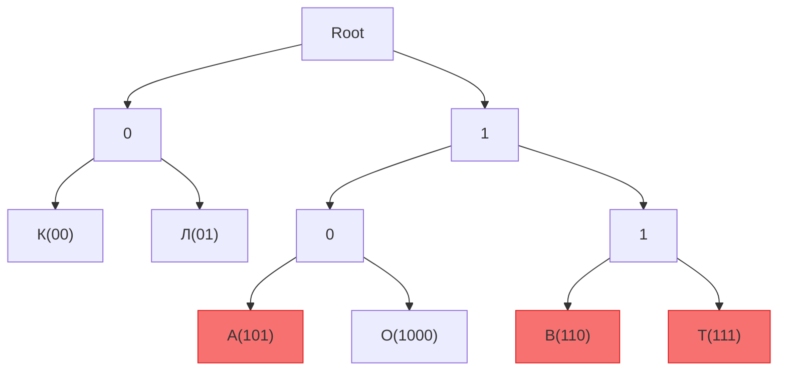

##  Кодирование с условием Фано

### Базовый пример построения дерева

* Каждая буква должна получить свой код, все которые есть в алфавите.
* Самая частая буква - самая маленькая по длине
* Если есть несколько вариантов дерева, проверь все 
---

### Решение для слова "АВТОЛАВКА"
**Условия**:
- Известные коды: К(00), Л(01), О(1000)
- Требуется закодировать 7 букв: А, В, К, Л, О, Т, Ц
- Частоты символов: А(3), В(2), Т(1), О(1), Л(1), К(1)

#### Вариант 1 (Оптимальный)


#### Вариант 2 (Альтернативный)


### Сравнение вариантов кодирования
| Буква | Частота | Вариант 1 | Вариант 2 |
|-------|---------|-----------|-----------|
| А     | 3       | 2 бита    | 3 бита    |
| В     | 2       | 3 бита    | 3 бита    |
| Т     | 1       | 5 бит     | 3 бита    |
| О     | 1       | 4 бита    | 4 бита    |
| Л     | 1       | 2 бита    | 2 бита    |
| К     | 1       | 2 бита    | 2 бита    |
| **Итого** |        | **25 бит** | **26 бит** |

```python
# Проверка оптимального решения
codes = {
    'А': '11',    # 2 бита
    'В': '101',   # 3 бита
    'Т': '10010', # 5 бит
    'О': '1000',  # 4 бита
    'Л': '01',    # 2 бита
    'К': '00'     # 2 бита
}

word = "АВТОЛАВКА"
total_bits = sum(len(codes[char]) for char in word)
print(f"Минимальная длина: {total_bits} бит")  # 25 бит
```
